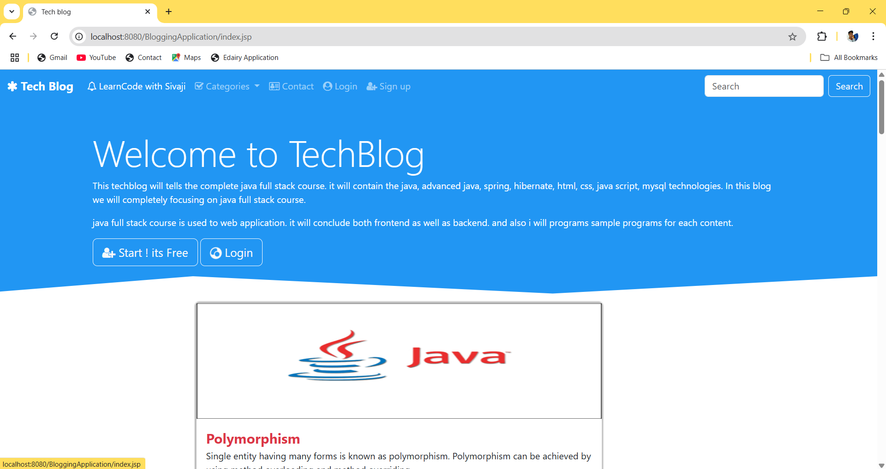
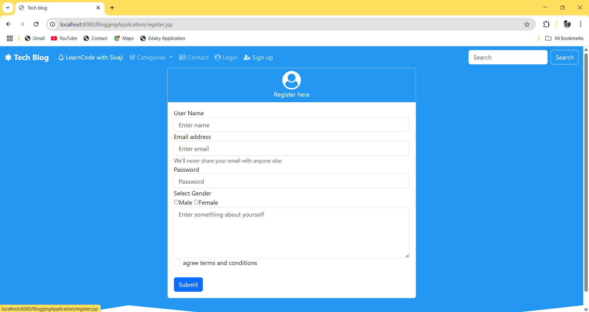
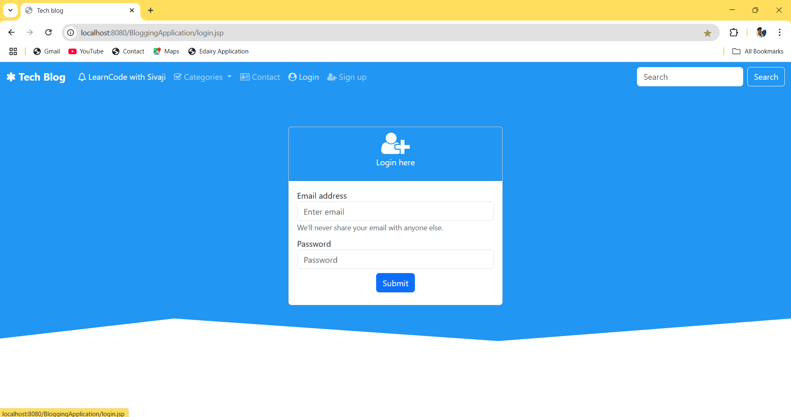
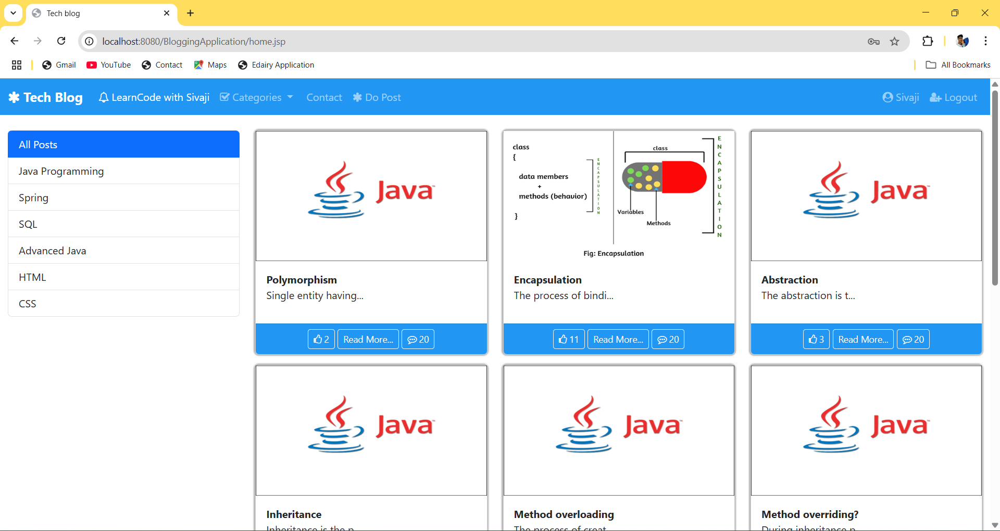
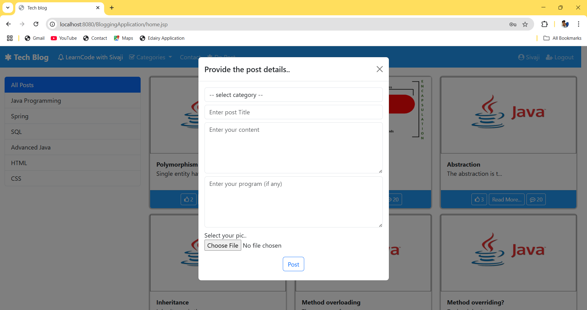
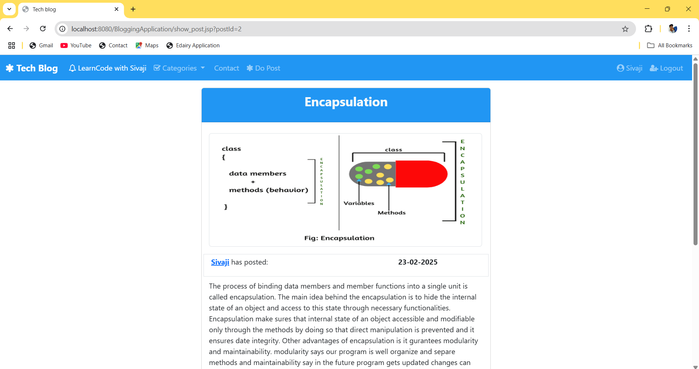
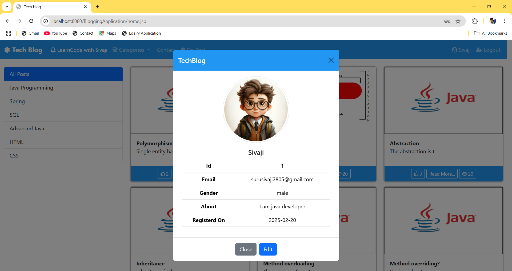
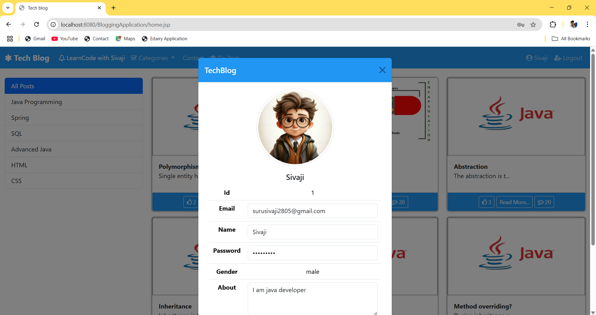
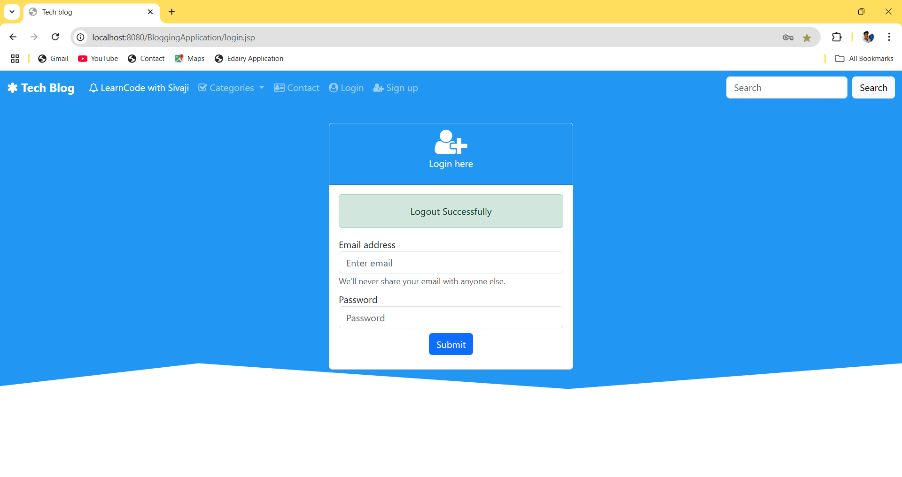

# 💻 Tech Blog

> A dynamic, responsive blogging platform built with JSP, Servlets, JDBC, Bootstrap, and MySQL.

---

## ✨ About The Project

Tech Blog is a user-friendly blogging application that allows users to register, log in, and share their thoughts with the world. The platform supports: user profiles, blog management, category filtering, and social interactions like likes.

**Key Highlights:**

- 🖥️ **Server-Side Rendering** with JSP & Servlets
- 🔗 **Database Connectivity** using JDBC & MySQL
- 🎨 **Responsive UI** powered by Bootstrap

---

## 🛠️ Built With
| Component   | Technology     |
|-------------|----------------|
| Front-End   | JSP, Bootstrap |
| Back-End    | Java Servlets  |
| Database    | MySQL          |
| Connectivity| JDBC           |

---

## 🚀 Getting Started

### Prerequisites
- Java JDK 8 or later
- Apache Tomcat (v8.5+)
- MySQL Server
- Maven or manual .war deployment

### Installation
1. **Clone the repo**
   ```bash
   git clone https://github.com/your-username/tech-blog.git
   cd tech-blog
   ```
2. **Import into IDE**
   - In Eclipse: File → Import → Existing Maven Projects
   - In IntelliJ: File → New → Project from Existing Sources
3. **Configure Tomcat**
   - Add the project as a web application in Tomcat

### Database Setup
1. **Create Database**
   ```sql
   CREATE DATABASE techblog;
   USE techblog;
   ```
2. **Run Schema Script** (`db/schema.sql`)
   ```sql
   -- Users
   CREATE TABLE Users (
     id INT AUTO_INCREMENT PRIMARY KEY,
     username VARCHAR(50) NOT NULL UNIQUE,
     email VARCHAR(100) NOT NULL UNIQUE,
     password VARCHAR(255) NOT NULL,
     created_at TIMESTAMP DEFAULT CURRENT_TIMESTAMP
   );
   
   -- Categories
   CREATE TABLE Categories (
     id INT AUTO_INCREMENT PRIMARY KEY,
     name VARCHAR(50) NOT NULL UNIQUE
   );
   
   -- Blogs
   CREATE TABLE Blogs (
     id INT AUTO_INCREMENT PRIMARY KEY,
     user_id INT NOT NULL,
     category_id INT,
     title VARCHAR(150) NOT NULL,
     content TEXT NOT NULL,
     created_at TIMESTAMP DEFAULT CURRENT_TIMESTAMP,
     FOREIGN KEY (user_id) REFERENCES Users(id),
     FOREIGN KEY (category_id) REFERENCES Categories(id)
   );
   
   -- Likes
   CREATE TABLE Likes (
     user_id INT,
     blog_id INT,
     PRIMARY KEY (user_id, blog_id),
     FOREIGN KEY (user_id) REFERENCES Users(id),
     FOREIGN KEY (blog_id) REFERENCES Blogs(id)
   );
   ```
3. **Configure JDBC** in `src/main/webapp/WEB-INF/db.properties`:
   ```properties
   url=jdbc:mysql://localhost:3306/techblog
   username=root
   password=yourpassword
   ```

---

## 🎯 Features
- ✅ **User Registration & Authentication**
- 👤 **Profile Management** (View & Update)
- ✍️ **Create & Edit Blogs**
- 📂 **Filter by Category**
- ❤️ **Like/Unlike Posts**

---

## 📸 Screenshots
### 📌 Index Page


### 📌 Registration Page


### 📌 Login Page


### 📌 Home Page


### 📌 Add Blog Page


### 📌 View Blog Page


### 📌 View Profile Page


### 📌 Edit Profile Page


### 📌 Logout Page


<hr>

## 🤝 Contributing
Contributions are welcome! Please:
1. Fork the repository
2. Create a feature branch (`git checkout -b feature-name`)
3. Commit your changes (`git commit -m 'Add feature'`)
4. Push to the branch (`git push origin feature-name`)
5. Open a Pull Request

---

*Made with ❤️ by Suru Sivaji*

